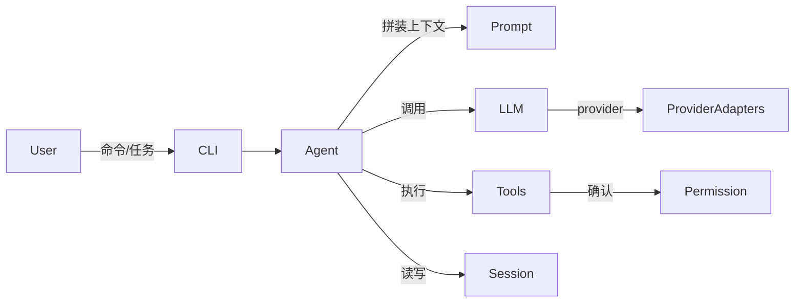

# we-code

轻量级 coding agent 框架（骨架阶段，业务逻辑待实现）。

## 模块结构

```
we-code/
├── cli/           # 入口：参数解析、组装依赖、启动会话
├── agent/         # loop、prompt、停止条件
├── tools/         # 每个工具一个类/文件
├── llm/           # provider 适配
├── session/       # 历史与状态
├── permission/    # 确认策略
├── demos/         # 固定可复现演示任务
└── README.md
```

## 架构



调用关系概览：

| 模块 | 职责 | 主要依赖 |
|------|------|----------|
| `cli` | 进程入口与装配 | agent / session / permission / llm / tools |
| `agent` | 思考-执行循环、提示词、停止条件 | llm / tools / session / permission |
| `tools` | 工具契约与注册 | permission |
| `llm` | LLM Provider 抽象与适配 | — |
| `session` | 会话历史与持久化 | — |
| `permission` | 工具确认与授权策略 | — |

## 演示

见 [`demos/`](./demos/)：

1. [`01-hello-refactor`](./demos/01-hello-refactor/) — 小范围重构
2. [`02-fix-null-npe`](./demos/02-fix-null-npe/) — 修复空指针
3. [`03-add-unit-test`](./demos/03-add-unit-test/) — 补单元测试

> 演示 GIF / asciinema 录屏后续补充。

## 构建

```bash
mvn -q -DskipTests package
```

运行入口（实现后）：

```bash
java -jar cli/target/cli-1.0-SNAPSHOT.jar
```
