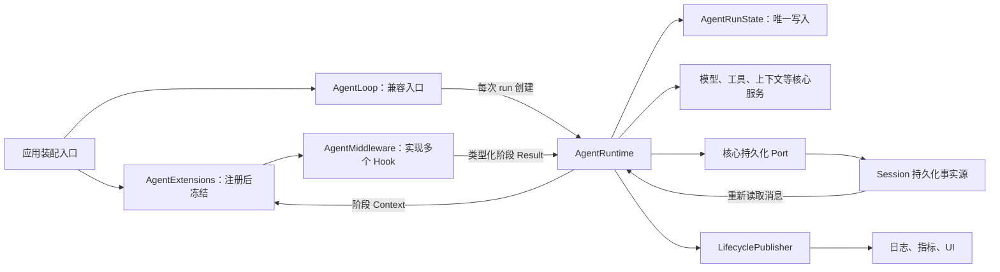
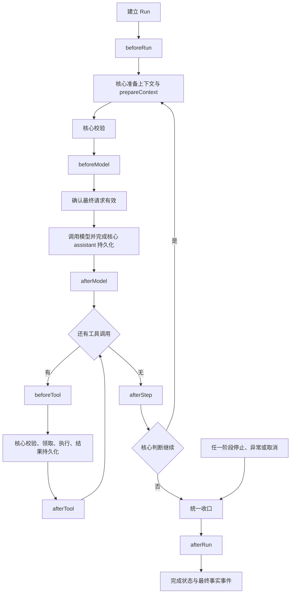
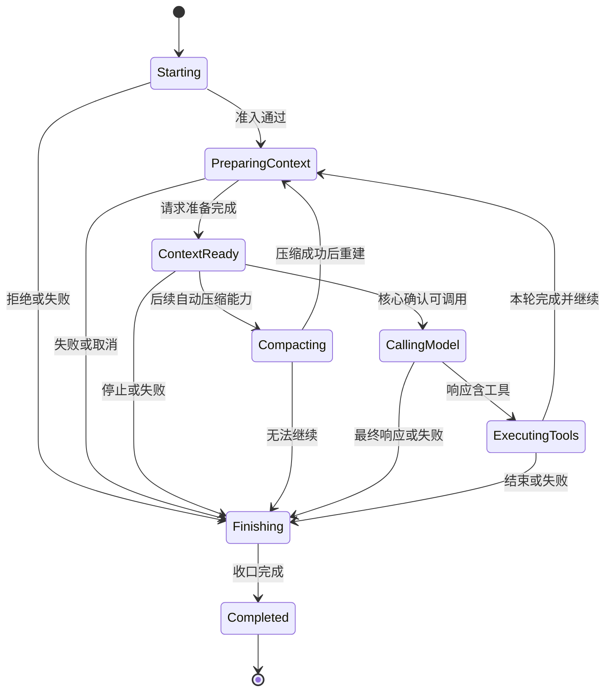

# Agent 横切扩展运行时（规划）

状态：运行状态类型已定义，以下 Runtime、扩展分发及迁移流程尚未接入 AgentLoop。当前行为仍以 [现有流程图](request-to-output-flow.md) 为准，契约见 [架构文档](../agent-lifecycle-hooks.md)。

## 职责与装配

Hook 是类型化阶段入口，Middleware 是实现入口的组件；不再设置相互独立的 HookRuntime 和 PipelineRuntime。扩展不能直接修改 Run 状态，Lifecycle 不能驱动控制流。

## 主循环接入骨架

图中 Hook 是目标位置，具体 Context/Result 随入口接入确定。提前停止或失败后不得继续普通执行链；收口防重复，清理失败不得掩盖原异常。afterTool 的加工与存储协议不在本轮确定。请求或工具输入若允许加工，核心必须校验最终有效值。

## 状态迁移约束

该图为粗粒度目标阶段关系，不是完整迁移 API；取消和异常统一进入 Finishing。现有类型只保证组合合法，后续还需定义迁移方法及阶段入口的精确位置。stateVersion 是 Run 内迁移版本，不是持久化或上下文内容版本。Compacting 已有类型，自动压缩尚未接入，也不是本轮框架接入的前提。
