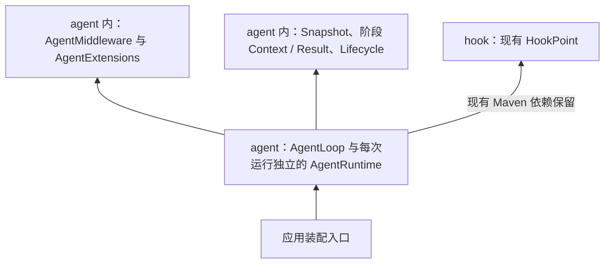

# Hook 模块与 Agent 扩展边界

状态：hook 模块仅实现 HookPoint，agent 已有 Maven 依赖；新的阶段扩展框架属于目标设计，尚未实现。

## 当前决定

- Hook 的目标语义是 beforeModel、afterTool 等类型化阶段方法，由 AgentMiddleware 实现、AgentExtensions 统一分发。
- 框架第一版放在 agent 内，用明确 Java 接口，不依赖动态 HookPoint 分发。
- hook 保持零业务模块依赖，现有 HookPoint 与 Maven 依赖先保留，不删除已有工作。
- 暂不实现旧计划中的 HookHandler、HookRegistry、HookRuntime；不另建 Pipeline Registry/Runtime 或 pipeline 模块。
- 不预设 Graph 复用或通用引擎提取方案，出现真实复用需求后再评估。
- AgentRuntime 保留状态迁移和核心执行权；业务扩展集中在 Middleware 与应用装配入口。

具体接入步骤见 [架构规划](../agent-lifecycle-hooks.md)。
