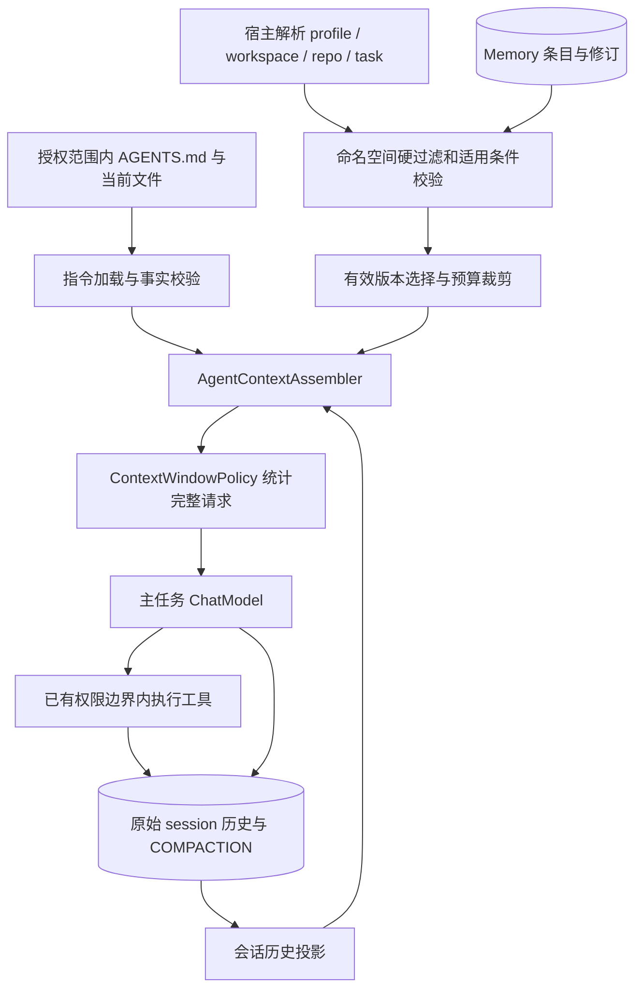
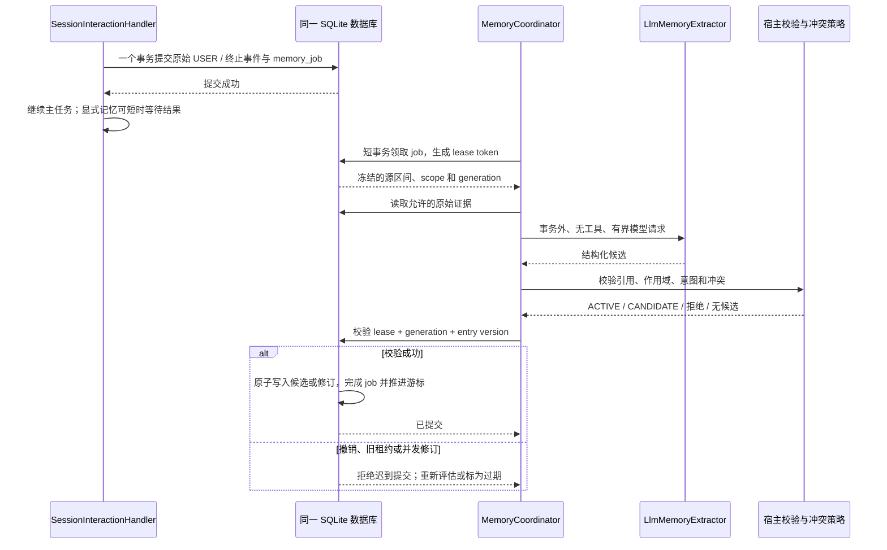
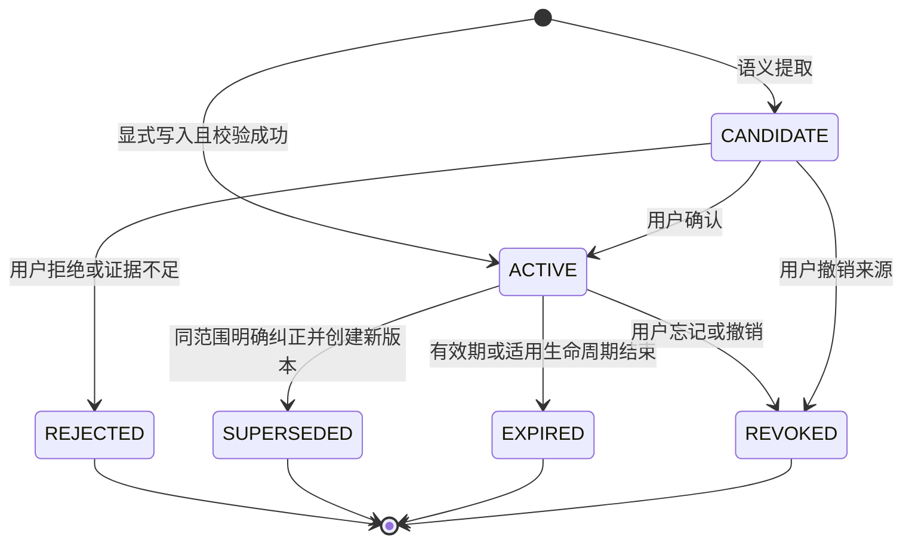
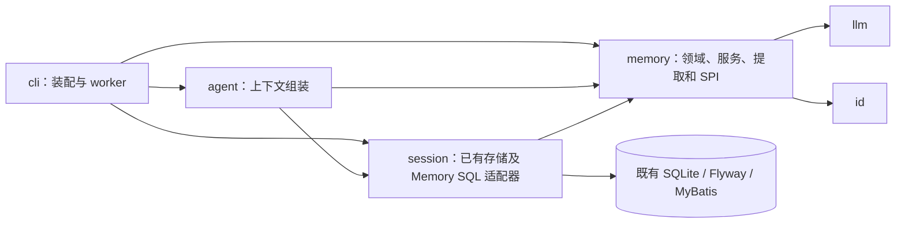

# Memory 架构与写入流程（规划）

状态：待实现设计，不能视为当前运行流程。详见 [Memory 架构规划](../memory-architecture.md)。现有 session/compaction 流程继续由原图描述。

## 上下文组成

Memory 动态注入结果不回写 session_message，不作为 Compaction 或长期提取的原始证据。图中主模型写回仅指其实际 assistant 响应，工具写回仅指执行状态和结果。

## 自动提取的事务边界（第 2 期）

## 记忆生命周期

REVOKED 不因旧任务重试自动恢复；重新记住必须是新的显式操作。历史版本保留不代表可进入当前检索。

## 初期模块依赖

此图只展示与 Memory 相关的拟议依赖，不替代全项目依赖图。memory 不反向依赖 session；SQL 适配器实现 memory SPI，来源通过证据端口注入。
