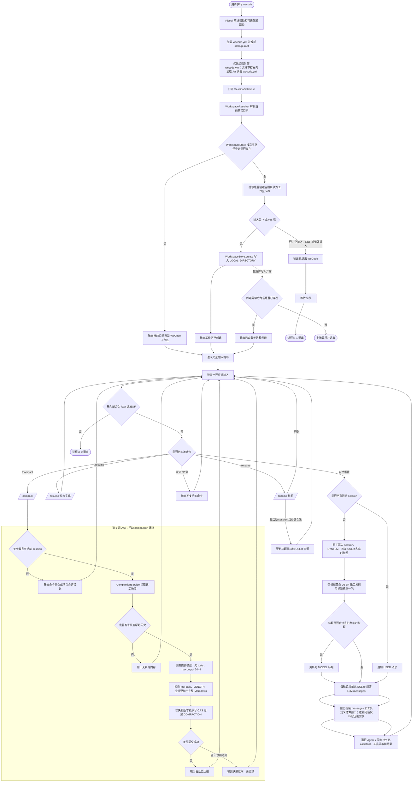

# WeCode 工作区启动流程图

当前 `wecode` 命令先检查当前启动目录是否已初始化为工作区；成功后进入长期交互循环。首条自然语言会创建并绑定一个 session，后续自然语言持续追加至该 session；`/resume` 暂未实现。

## 当前边界

- 工作区路径由 `WorkspaceResolver` 解析为当前启动目录的真实路径；查询与创建始终使用同一文本。
- 创建记录固定为 `LOCAL_DIRECTORY`；Git 类型识别暂不影响持久化类型。
- 用户输入仅接受 `Y`/`yes`（忽略大小写与首尾空白）；`N`/`no`、其他输入、空输入和 EOF 都不会创建工作区。
- 用户取消后由 `WorkspaceStartupService` 输出退出提示、等待 5 秒，再由 `Main` 以退出码 `1` 结束；测试注入等待器，不进行真实等待。
- 工作区确认成功后，`Main` 将同一个 `BufferedReader` 交给交互循环，避免不同读取器竞争 `System.in`。`/exit`（忽略首尾空白）或 EOF 时以退出码 `0` 结束。
- 首条非命令自然语言会创建 session，并在同一事务中写入固定 system prompt、首条 USER 和从首条消息截断的临时标题。标题模型仅在此处调用一次；失败、超时或非法结果时保留临时标题，后续消息、程序重启和未来 `/resume` 都不会自动重试。
- `/rename <title>` 仅修改当前活动 session，标题标记为 `USER`；模型标题只可替换 `TEMPORARY` 标题，不能覆盖手动重命名。未知斜杠命令不会被当作自然语言，因此不会意外创建 session。
- 后续自然语言只向当前活动 session 追加 USER 消息。`activeSessionId` 仅保存在进程内作为选中标识；LLM 历史不再从内存 `Session` 读取。
- 每次模型请求前，Agent 从 SQLite 组装有序 `messages`：始终使用会话创建时持久化的首条 SYSTEM；存在 compaction 时紧随其后以带固定安全前缀的 ASSISTANT 历史消息注入最新摘要，并按 `sequence_no ASC` 回放其覆盖边界后的非压缩尾部。ASSISTANT 的 `tool_calls` 与紧随其后的终态 TOOL observation 一并恢复；未完成工具调用会拒绝构造请求上下文。
- 每次模型请求前按已组装消息与工具定义的 Unicode 字符数除以四估算输入 token。当前统一按 300k 上下文窗口、20k 安全余量和零输出 token 占位预算计算压缩阈值；达到阈值仅标记需求，尚不生成新的压缩摘要。
- `/compact` 是精确匹配且不接收参数的本地控制命令，不会作为 USER 消息或 Agent 轮次写入会话历史。它仅对当前活动 session 调用不感知触发来源的 `CompactionService`。
- `CompactionService` 在短暂读取中取得包含会话版本和最后序号的稳定快照，在数据库事务外生成摘要并校验固定 Markdown，然后以 CAS 追加 `COMPACTION`。若历史在生成期间变化，只返回过期快照而不写入旧摘要；没有新增历史时不调用模型。
- 第 1 期仍采用 `keepRecentTokens = 0`：一次手动压缩覆盖当前全部可压缩历史。自动压缩、原文尾部保留和 Provider overflow 恢复尚未接入。
