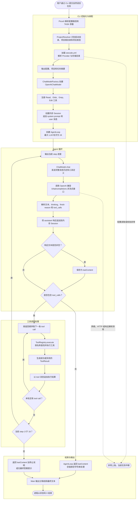

# 用户请求到最终输出流程图

本图描述当前 CLI 一次性任务的实际执行流程，入口为 `org.wecode.cli.Main`，核心循环为 `org.wecode.agent.AgentLoop`。

## 当前实现边界

- `Session` 当前仅维护内存消息列表；`workspaces`、`sessions`、`session_message` 和 `tool_execution` 四张表尚未接入这条 CLI 调用链，因此进程结束后本次对话不会由该流程持久化。
- LLM 请求当前是非流式调用，收到完整 `LlmResponse` 后才继续执行。
- 同一轮中的多条工具调用按模型返回顺序串行执行；工具失败也会转换为 `tool` 消息回灌给模型，由模型决定下一步。
- 正常停止条件只有“本轮没有工具调用”；达到 16 轮后强制停止。`StopCondition` 类当前尚未接入。
- `permission` 模块当前没有在 `Main` 或 `AgentLoop` 中参与工具执行授权。

## 主要代码位置

- `cli/src/main/java/org/wecode/cli/Main.java`：CLI 参数解析、依赖装配和最终输出。
- `agent/src/main/java/org/wecode/agent/AgentLoop.java`：模型调用、工具执行和停止逻辑。
- `llm/src/main/java/org/wecode/llm/chat/OpenAiChatModel.java`：请求构造、HTTP 调用和响应解析。
- `tools/src/main/java/org/wecode/tools/registry/ToolRegistry.java`：工具注册、查找和执行。
- `session/src/main/java/org/wecode/session/Session.java`：当前的内存消息历史。
