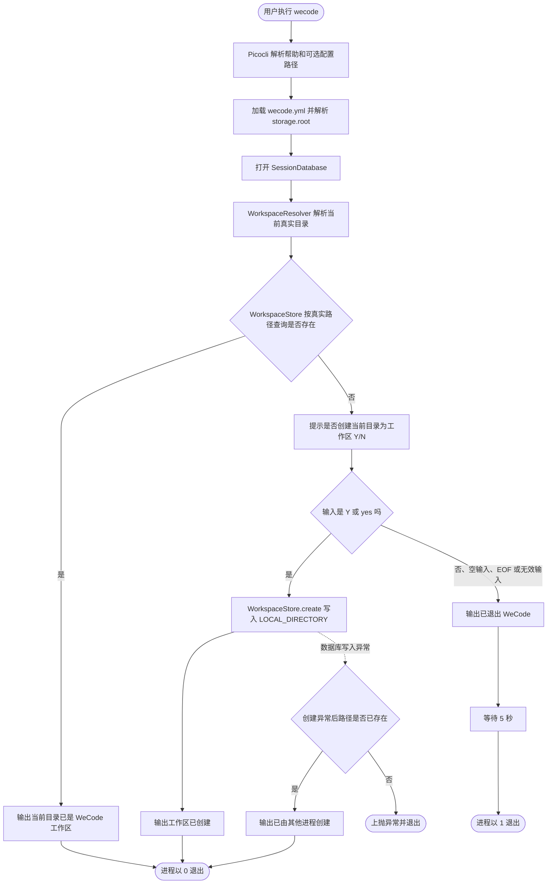

# WeCode 工作区启动流程图

当前 `wecode` 命令只检查当前启动目录是否已初始化为工作区；不接收任务参数，也不启动 Agent。

## 当前边界

- 工作区路径由 `WorkspaceResolver` 解析为当前启动目录的真实路径；查询与创建始终使用同一文本。
- 创建记录固定为 `LOCAL_DIRECTORY`；Git 类型识别暂不影响持久化类型。
- 用户输入仅接受 `Y`/`yes`（忽略大小写与首尾空白）；`N`/`no`、其他输入、空输入和 EOF 都不会创建工作区。
- 用户取消后由 `WorkspaceStartupService` 输出退出提示、等待 5 秒，再由 `Main` 以退出码 `1` 结束；测试注入等待器，不进行真实等待。
