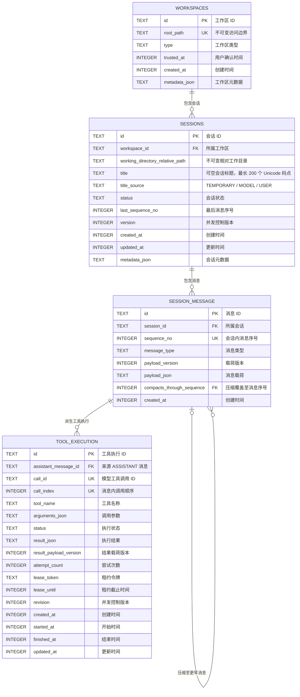

# 会话数据库实体关系图

本图对应 `session` 模块当前的四张 baseline V1 数据库表，数据结构以迁移脚本 `V1__create_baseline_schema.sql` 为准。

## 关系与约束说明

- 一个 `workspaces` 记录可以包含零到多个 `sessions`；会话通过 `workspace_id` 获取唯一权威的工作区访问边界，不重复保存根路径。
- `workspaces.root_path` 和会话的 `workspace_id + working_directory_relative_path` 都由触发器保证创建后不可修改；需要切换目录时必须创建新的工作区或会话。
- `sessions.title` 可为 `NULL`，表示尚未命名；非空时长度限制为 1 到 200 个 Unicode 码点。`title_source` 与标题同时为空或同时存在：`TEMPORARY` 表示首条用户消息截断标题，`MODEL` 表示一次模型命名结果，`USER` 表示 `/rename` 手动标题。
- 模型标题更新仅匹配 `title_source = TEMPORARY`；`/rename` 会更新为 `USER`。标题更新同时递增会话 `version`，避免迟到的模型结果覆盖手动重命名。
- `working_directory_relative_path` 相对于 `workspaces.root_path`，工作区根目录使用 `.` 表示。应用加载会话时必须解析并再次验证结果没有越过工作区根目录。
- 一个 `sessions` 记录可以包含零到多条 `session_message`；每条消息必须属于一个会话。删除会话时，其消息通过 `ON DELETE CASCADE` 级联删除。
- 一条 `session_message` 可以派生零到多条 `tool_execution`；每条工具执行必须关联一条消息。数据库触发器进一步保证该消息的类型必须为 `ASSISTANT`。删除消息时，其工具执行记录级联删除。
- `session_message` 通过 `(session_id, compacts_through_sequence)` 自关联 `(session_id, sequence_no)`。只有 `COMPACTION` 消息允许且必须设置该字段，并且只能指向同一会话内序号更小的已有消息。
- `session_message` 的实际唯一约束是 `(session_id, sequence_no)`；图中 `sequence_no` 的 `UK` 标记表示它参与该复合唯一键，并非全表单列唯一。
- `tool_execution` 分别对 `(assistant_message_id, call_id)` 和 `(assistant_message_id, call_index)` 设置复合唯一约束；图中的两个 `UK` 标记均表示参与复合唯一键。
